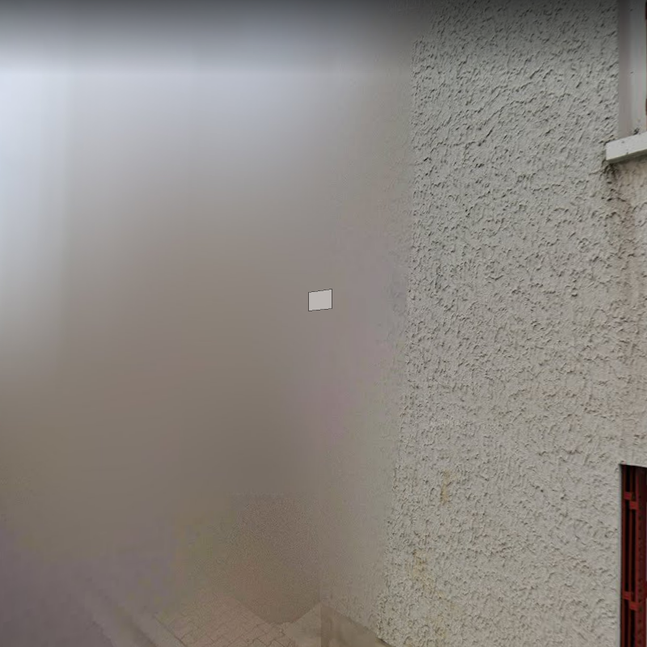

# deep-geo-guessr

Geo Gusser is a game where the player is randomly dropped onto a Google Street View map and has to guess the current location based on the surroundings.\
In this research, the problem was simplified not to the exact location but to the country of origin of the image.\
The goal is to create a neural network that can predict a country name for a given Google Street View image.

## Data

Data was collected from 5 different countries: France, Greece, Portugal, Spain and Switezerland.\
The dataset is balanced and each class contains over 1000 samples with a resolution of 800x800px.\
Dataset is unclean, photos have many imperfections, for example: majority of picture is blurred or shows interior of building.

Incorrect examples:

    
    
    

Correct examples:

    
    
    

    
    

Depending on notebook, different data augmentation is used.\
Techniques used:
- RandomCrop
- RandomRotation
- RandomHorizontalFlip
- RandomVerticalFlip
- RandomPerspective

Data cannot be shuffled, because there are multiple images from one place.
Due to the use of ResNet, data is normalized with ImageNet values.

## Neural Network

The network is based on the pretreated ResNet18 model with replaced fully connected layer.\
SGD optimizer was used to train the model and the cross entropy as a function of loss.

## Results

At this point, a result of ~50% accuracy on test samples has been achieved.

    

## Interpreting and Understanding Predictions

In the future, it is planned to implement methods to interpret, understand, and visualize network predictions.
