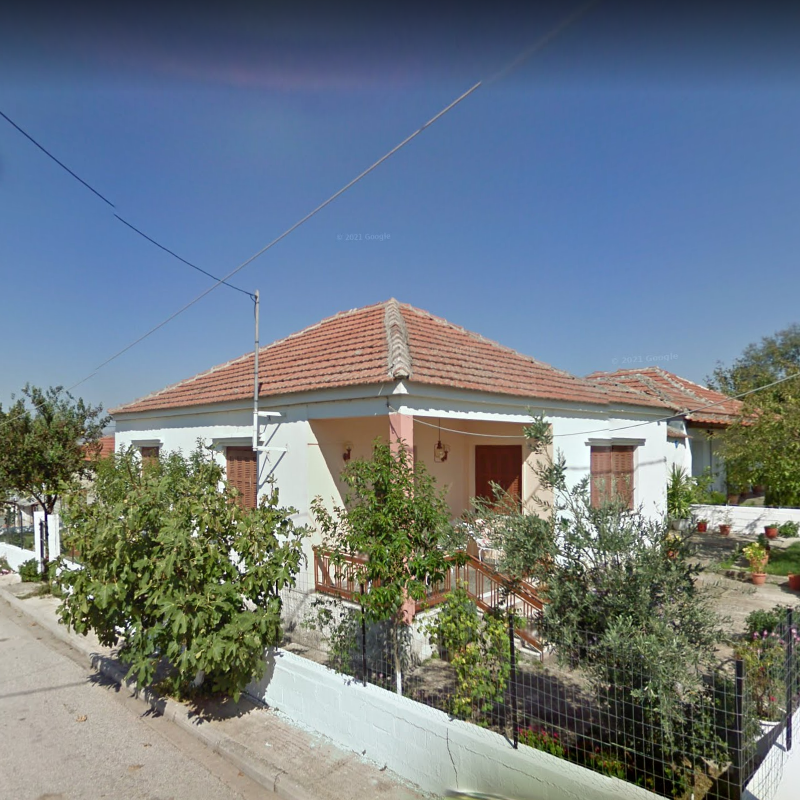

# deep-geo-guessr

Geo Gusser is a game where the player is randomly dropped onto a Google Street View map and has to guess the current location based on the surroundings.\
In this research, the problem was simplified not to the exact location but to the country of origin of the image.\
The goal is to create a neural network that can predict a label for a given Google Street View image.

## Data

Data was collected from 5 different countries: France, Greece, Portugal, Spain and Switezerland.\
The dataset is balanced and each class contains 1000 samples with a resolution of 800x800px.

    
    
    

    
    

For better accuracy and to prevent overfitting of the model, data augmentation was used.\
Due to the use of ResNet, data is normalized with ImageNet values.

## Neural Network

The network is based on the pretreated ResNet18 model.\
SGD optimizer was used to train the model. Weighted cross entropy was used as the loss function.\
The loss weights for the individual classes were adjusted based on the observational data from the test trainings.

## Results

At this point, a result of ~50% accuracy on test samples has been achieved.

    

The following steps can be taken to improve the accuracy of the model:
- Better data cleaning
- Using more data
- Using bigger model
- Using a different loss function

## Interpreting and Understanding Predictions

In the future, it is planned to implement methods to interpret, understand, and visualize network predictions.
