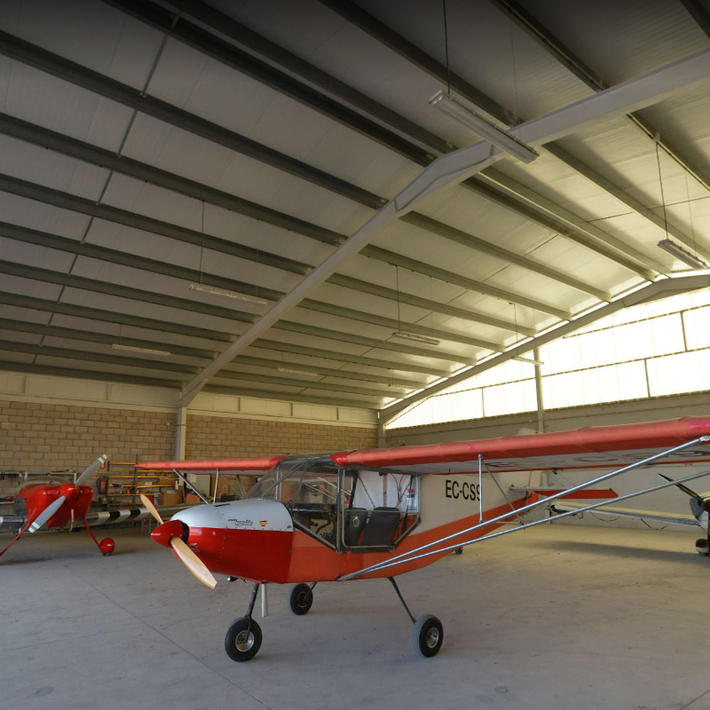
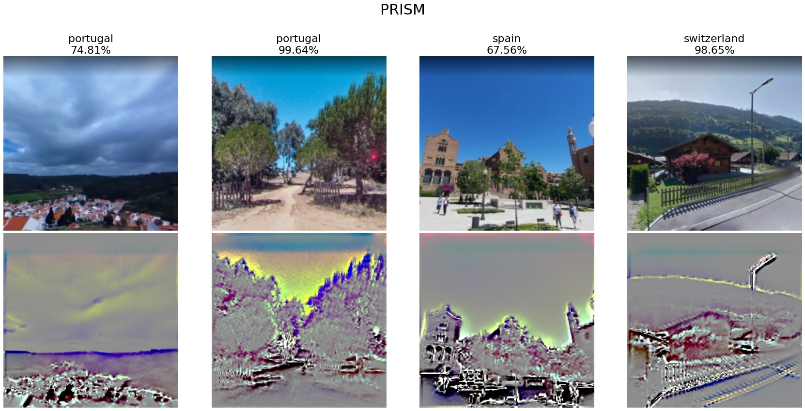

# **deep-geo-guessr**

Geo Guessr is a game where the player is randomly dropped onto a Google Street View map and has to guess the current location based on the surroundings.\
In this research, the problem was simplified not to the exact location but to the country of origin of the image.\
The goal is to create a neural network that can predict a country name for a given Google Street View image.

# Data

Data was collected from 5 different countries: France, Greece, Portugal, Spain and Switezerland.\
The dataset is balanced and each class contains over 1000 samples with a resolution of 800x800px.\
Dataset is unclean, photos have many imperfections, for example: majority of picture is blurred or shows interior of building.

Incorrect examples:

    
    
    

Correct examples:

    
    
    

    
    

Depending on notebook, different data augmentation is implemented. \
Techniques used:
- RandomCrop
- RandomRotation
- RandomHorizontalFlip
- RandomVerticalFlip
- RandomPerspective

Data cannot be shuffled, because there are multiple images from one place.
Due to the use of ResNet, data is normalized with ImageNet values.

# Neural Network

The network is based on the pretreated ResNet18 model with replaced fully connected layer. \
SGD optimizer was used to train the model and the Focal Loss as a function of loss. \

To perform the training efficiently, the code was optimized mainly based on [1] and [2].

# Results

At this point, a result of ~50% accuracy on test samples has been achieved.
The confusion matrix shows that most of the bad predictions occur between countries that border each other or have similar climates.

    

Accuracy of model validation during training and hyperparameters. Tracked with W&B platform. \
[Project dashboard](https://wandb.ai/konradszafer/deep-geo-guessr?workspace=user-konradszafer)

    

    

# Interpreting and visualization predictions

## Weights visualization

    

## Class activation mapping

    

## Grad cam

    

## Interesting regions

    

## Torch PRISM

    

# Future work

- Adding country-specific elements, such as flags, writing, and other symbols, as a method of data augmentation.
- Define the probelm as a regression task for determining geographic coordinates to reduce border bias.
- More precise manual data cleaning.

# Bibliography

[1] https://towardsdatascience.com/what-library-can-load-image-in-python-and-what-are-their-difference-d1628c6623ad \
[2] https://towardsdatascience.com/optimize-pytorch-performance-for-speed-and-memory-efficiency-2022-84f453916ea6 \
[3] https://arxiv.org/pdf/1311.2901.pdf
